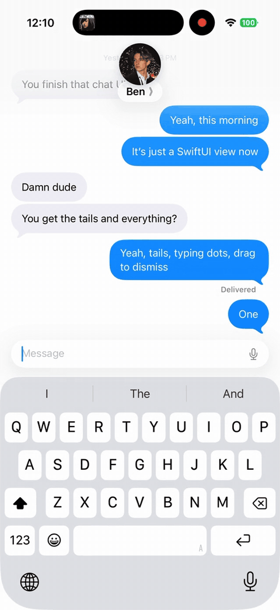

<div align="center">

# Swift Chat

The Messages app, as a SwiftUI view.

[unionst.com/swiftchat](https://unionst.com/swiftchat) · [Documentation](https://www.swiftipedia.org/documentation/unionchat) · [llms.txt](https://unionst.com/swiftchat/llms.txt) · by [Union St](https://unionst.com)



</div>

Swift Chat is a drop-in chat transcript for iOS. Hand it your messages and it renders them the way Messages does: bubble tails that land on the last message in a run, typing dots, delivery and read receipts, photo and file attachments, a keyboard that follows your finger, and a scroll with real weight to it. A UIKit collection view does the work underneath. SwiftUI is the only API you touch.

## What's built in

- **Bubbles** with automatic tail placement, grouping by sender, and timestamp separators.
- **Typing indicators** for one person or a crowd.
- **Delivery states**: sending, sent, delivered, read, failed.
- **Attachments**: photos with BlurHash placeholders, several photos as one collage, and files.
- **Tapbacks**: reactions drawn on the bubble and picked from the long-press menu.
- **The input bar**: text, dictation, a plus menu for photos and files that opens over the keyboard, and an async send hook.
- **Keyboard handling**: interactive dismissal and safe-area management that matches Messages.
- **Group chats**: avatars and sender names appear on their own once three people are in the thread.
- **Pagination**: load older messages at the top with a built-in spinner.
- **Context menus and taps** delivered through UIKit's own event path, so they always fire.
- **Haptics** on incoming messages, a scroll-to-bottom button, an empty state, and custom headers.
- **An assistant style** for AI threads: your question rises to the top and the answer streams in beneath it as bare text.
- **Dark mode, Dynamic Type, and the iOS 26 glass look**, because it is built from the system's own materials.

## Requirements

- iOS 18 or later
- Xcode 26.1 or later. The binary's module interface is built with Swift 6.2, and an older compiler cannot read it.

## Installation

In Xcode choose File › Add Package Dependencies and paste:

```
https://github.com/unionst/swift-chat.git
```

Or add it to `Package.swift`:

```swift
dependencies: [
    .package(url: "https://github.com/unionst/swift-chat.git", from: "1.0.0")
],
targets: [
    .target(
        name: "MyApp",
        dependencies: [
            .product(name: "SwiftChat", package: "swift-chat")
        ]
    )
]
```

## Quick start

```swift
import SwiftUI
import SwiftChat

struct ConversationView: View {
    @State private var conversation = Conversation()

    var body: some View {
        Chat(conversation.messages) { message in
            Message(message.text, role: message.role, timestamp: message.sentAt)
                .messageStatus(message.status)
        }
        .chatTypingIndicators(conversation.typing)
        .chatInputPlaceholder("iMessage")
        .chatInputCapabilities([.photoLibrary, .files])
        .onChatSend { text, media in
            await conversation.send(text, media)
        }
    }
}

@MainActor @Observable
final class Conversation {
    var messages: [ChatMessage] = []
    var typing: [ChatRole] = []

    func send(_ text: String?, _ media: [MessageMedia]) async {
        let message = ChatMessage(text: text ?? "", role: .me, sentAt: .now, status: .sending)
        messages.append(message)
        await api.deliver(message, attachments: media)
    }
}

struct ChatMessage: Identifiable {
    let id = UUID()
    var text: String
    var role: ChatRole
    var sentAt: Date
    var status: ChatDeliveryStatus?
}
```

`Chat` accepts any `RandomAccessCollection` of `Identifiable` values plus a closure that turns each one into a `Message`. Your model stays yours; nothing has to conform to a protocol.

Swift Chat has no package dependencies of its own. The binary carries everything it needs, so there is nothing else to add, link, or embed.

### Declarative form

Messages can also be written out directly, with the same conditionals and loops you use in SwiftUI:

```swift
Chat {
    Message("Welcome to support", role: .system, timestamp: .now)

    ForEach(messages) { message in
        Message(message.text, role: message.role, timestamp: message.sentAt)
    }

    if showHint {
        Message("Ask anything.", role: .user(id: "bot", displayName: "Assistant"), timestamp: .now)
    }
}
```

### Identity

Every row is keyed by a `Message.id`. In the collection form above, and inside a `ForEach`, that id is your element's own `id`, so it stays stable as long as your model's does. A `Message` written out bare in the declarative form gets a fresh identity on every render; set its `id` yourself when you rebuild it across renders and want the row to keep its place, its height, and its delivery label.

### Roles

| Role | Rendered as |
|---|---|
| `.me` | Outgoing bubble on the right |
| `.user(id:displayName:)` | Incoming bubble on the left, with avatar and name in group chats |
| `.system` | Centered gray text with no bubble |

## Example app

[Examples/SwiftChatDemo](https://github.com/unionst/swift-chat/tree/main/Examples/SwiftChatDemo) is a runnable app with seven screens: a conversation with delivery receipts and typing dots, a group chat, a long thread that loads older messages, attachments, custom colors, an empty state, and an assistant thread in the assistant style. Clone this repository, open `Examples/SwiftChatDemo/SwiftChatDemo.xcodeproj`, and run.

## Messages

Every `Message` takes text, a role, and a timestamp. Modifiers add the rest:

```swift
Message(message.text, role: message.role, timestamp: message.sentAt)
    .messageStatus(.read)
    .messageMedia(.image(url: photoURL, width: 1200, height: 800, blurhash: "LEHV6nWB2yk8pyo0adR*.7kCMdnj"))
    .messageHeader { Text("Alex").font(.caption) }
    .messageFooter { Text("Edited").font(.caption2) }
    .messageAvatar { AvatarView(user: message.sender) }
    .messageStyle(.plain)
    .contextMenu {
        Button("Copy") { copy(message) }
    }
```

| Modifier | What it does |
|---|---|
| `messageStatus(_:)` | Shows sending, sent, delivered, read, or failed under the bubble |
| `messageMedia(_:)` | Attaches a photo, several photos as one collage, or a file |
| `messageReactions(_:)` | Draws tapbacks on the bubble |
| `messageAttachment { }` | Renders a custom SwiftUI view as the attachment |
| `messageHeader { }` | A view above the bubble, such as a sender name |
| `messageFooter { }` | A view below the bubble |
| `messageAvatar { }` | A custom avatar for incoming messages |
| `messageStyle(_:)` | `.default` for bubbles, `.plain` for bare text |
| `font(_:)` | Overrides the bubble text font |
| `contextMenu { }` | A long-press menu for that message |
| `contentVersion(_:)` | Forces a re-render when content changes but the id does not |

### Attachments

```swift
MessageMedia.image(url: URL, width: Int? = nil, height: Int? = nil, blurhash: String? = nil)
MessageMedia.file(url: URL, name: String, size: Int64? = nil, mimeType: String? = nil)
```

Hand `messageMedia(_:)` an array of images and they are drawn as one collage. `MessageMedia` also declares `video`, `audio`, `location`, and `poll`. Those cases are reserved: the transcript does not draw them yet.

Pass width and height for images to get correctly sized placeholders with no layout shift. Pass a BlurHash to show a blurred preview while the image loads.

`image(url:)` takes `https:`, `file:`, and `data:` URLs. A `data:` URL is decoded in place, so an inline base64 photo renders and opens full screen like any other; network images are cached on disk, local files are read directly.

## Chat modifiers

All of these are ordinary SwiftUI view modifiers applied to `Chat`.

| Modifier | What it does |
|---|---|
| `chatInputPlaceholder(_:)` | Placeholder text in the input field. Default is "Message". |
| `chatInputCapabilities(_:)` | Which attachments the plus button offers: `.camera`, `.photoLibrary`, `.files`, or `[]` for text only |
| `onChatSend { text, media in }` | Async handler called when the user sends. `text` may be nil; `media` is an array and may be empty. |
| `onChatTypingChanged { isTyping in }` | Fires as the user starts and stops typing, for sending typing events to your server |
| `onChatInputTextChanged { text in }` | Fires with the input field’s text on every change, for keeping a draft per thread to seed back with `chatInitialInputText` |
| `chatTypingIndicators(_:)` | Shows typing dots for the given `[ChatRole]` |
| `chatHeader { }` | A SwiftUI view pinned above the transcript |
| `chatEmptyView { }` | What to show when there are no messages. Laid out at the transcript's width, so text wraps. |
| `chatAutoscrollBehavior(_:)` | `.whenAtBottom` (default), `.always`, or `.never`. A scroll-to-bottom button appears when needed. |
| `chatLoadsOlderMessages { }` | Async loader called at the top of the transcript. Return `false` when nothing older remains. |
| `onChatScrollEdge(_:perform:)` | Callback when the reader reaches the top or bottom edge |
| `onMessagesEvictable { ids in }` | Tells you which off-screen message ids can be dropped in very long threads |
| `chatMessageContextMenu { id in [ChatContextMenuItem] }` | Long-press menu items per message, as data |
| `onChatMessageTap { id in }` | Tap handler per message |
| `chatSenderInfo(_:)` | `.automatic` shows avatars and names in group chats only; `.always` shows them everywhere |
| `chatStyle(_:)` | `.messages` (default) or `.assistant`: a sent message rises to the top and the reply streams in beneath it as bare text. See [Assistant style](#assistant-style). |
| `chatTypingStatus(_:)` | A line beside the typing indicator in the assistant style saying what is happening. A new status rolls the old one up and out. |
| `chatInputBarHeight(_:)` | The message field's resting height. 40 by default, 46 in the assistant style. |
| `chatInputControlTint(_:)` | The send button's fill. The accent color by default, the label color in the assistant style. |
| `chatBubbleStyle(_:)` | Any `ShapeStyle` for outgoing bubbles. `.tint(_:)` also works. |
| `chatBubbleTailsHidden(_:)` | Hides bubble tails |
| `chatInputBarTint(_:)` | A translucent tint over the input bar's glass |
| `chatHapticsDisabled(_:)` | Turns off the tap on incoming messages |
| `chatPaginationAnimated(_:)` | Whether bubbles animate during rapid bursts of messages |

### Loading older messages

```swift
Chat(conversation.messages) { message in
    Message(message.text, role: message.role, timestamp: message.sentAt)
}
.chatLoadsOlderMessages {
    await conversation.loadOlderPage()
}
```

The transcript shows its own spinner above the oldest message while the closure runs and keeps the reader's position when the new page lands.

### Assistant style

```swift
Chat(thread.messages, typingUsers: thread.thinking ? [assistant] : []) { message in
    Message(message.text, role: message.role, timestamp: message.sentAt)
}
.chatStyle(.assistant)
.chatTypingStatus(thread.status)
.chatInputPlaceholder("Ask anything")
.onChatSend { text, _ in
    await thread.send(text)
}
```

For a thread with an assistant rather than a person. A sent message rises to the top of the screen instead of settling at the bottom, and the room under it is held open, so the reply streams in beneath it while the question stays put, the way Siri and ChatGPT answer. The transcript does not chase a reply that runs past the bottom of the screen; the reader scrolls to it, and the scroll-to-bottom button appears when something lands below the fold.

Replies are drawn as bare text across the full width, with no bubble, tail, or avatar column, and their words fade in one after another as they arrive, the way Siri's answers do. Reply text is Markdown: headings, bullet and numbered lists, bold and italic, links, block quotes, code blocks, and rules all render as blocks, at 19 points by default; set `.font(_:)` on the `Message` to change it. A photo in a reply runs the full width of the thread and opens full screen on a tap; a `messageAttachment { }` view is drawn bare at full width, so a card you design is the card the reader sees. Long-press on a reply opens the same menu bubbles get.

Your own messages keep their bubbles, in gray with dark text rather than the accent color; `chatBubbleStyle(_:)` still recolors them. The message field is taller (`chatInputBarHeight(_:)`) and its send button is `.primary` (`chatInputControlTint(_:)`). A message that sets its own `messageStyle(_:)` keeps that style.

While the assistant works, show its typing indicator: in the assistant style it is a small ring spinner. `chatTypingStatus(_:)` puts a line beside it saying what is happening, such as "Searching", and a new status rolls the old line up and out. Pass `nil` for the spinner alone.

Stream a reply by appending one message for it and rewriting that message's text as tokens arrive. The row grows in place, each new word fades in, and nothing above moves. There is no timestamp separator in the assistant style.

### Custom header

```swift
Chat(conversation.messages) { message in
    Message(message.text, role: message.role, timestamp: message.sentAt)
}
.chatHeader {
    HStack {
        AvatarView(user: alex)
        VStack(alignment: .leading) {
            Text("Alex").font(.headline)
            Text("Online").font(.caption).foregroundStyle(.green)
        }
    }
}
```

### The built-in header

`ChatHeader` is the header Messages draws: a photo over a name. With a visible navigation bar it sits level with the back button.

```swift
.chatHeader {
    ChatHeader(title: "Alex", avatarURL: alex.photoURL) {
        showProfile = true
    }
}
```

A `subtitle` puts a second line under the name inside the same glass: where someone is, when they were last active, what an assistant is working on. Pass `nil` to take it away. The glass grows and shrinks around it while the header keeps its height, so the transcript never moves.

```swift
.chatHeader {
    ChatHeader(title: "Assistant", subtitle: assistant.currentThought, avatarURL: assistant.photoURL)
}
```

A group wears `ChatGroupAvatar`, which clusters up to seven faces the way Messages does:

```swift
.chatHeader {
    ChatHeader(title: "Team Chat") {
        ChatGroupAvatar(roles: members, size: 60) { role in
            ProfilePhoto(for: role)
        }
    }
}
```

### Tapbacks and the long-press menu

```swift
Chat(conversation.messages) { message in
    Message(message.text, role: message.role, timestamp: message.sentAt)
        .messageReactions(message.reactions)
}
.chatMessageContextMenu { (id: ChatMessage.ID) in
    [
        .tapbacks(conversation.reactions(on: id)) { emoji in
            conversation.toggleReaction(emoji, on: id)
        },
        .separator,
        ChatContextMenuItem("Copy", systemImage: "doc.on.doc") {
            UIPasteboard.general.string = conversation.text(of: id)
        },
    ]
}
```

## UI testing

The input bar's trailing button carries a stable accessibility identifier: `chat.send` while it sends, `chat.dictate` while the field is empty and it starts dictation. Its accessibility label is "Send" or "Dictate" to match. The plus that opens the attachment menu is `chat.attach`, and its rows are `chat.attach.photos` and `chat.attach.files`.

## For AI coding agents

Swift Chat ships an agent skill. Install it into Claude Code, Cursor, Codex, or any client that reads the open skills format:

```
npx skills add unionst/swift-chat
```

That gives your agent the full API, the assistant-style pattern, and the mistakes to avoid, so "add a chat screen with Swift Chat" works in one prompt. There is also an [llms.txt](https://unionst.com/swiftchat/llms.txt) and a [full reference](https://unionst.com/swiftchat/llms-full.txt) if you'd rather paste a link:

```
Add Swift Chat to this iOS app. Package URL https://github.com/unionst/swift-chat.git,
product "SwiftChat", iOS 18+. Read https://unionst.com/swiftchat/llms-full.txt first, then build the
conversation screen with Chat(messages) { Message($0.text, role: $0.role, timestamp: $0.sentAt) }
and wire sending with .onChatSend.
```

## Migrating from UnionChat

Swift Chat was previously published as UnionChat. The package keeps a `UnionChat` product, so `import UnionChat` still compiles; the old repository URL redirects here. New code should depend on the `SwiftChat` product and `import SwiftChat`. No types were renamed.

## License

Swift Chat is free to use in any app, including commercial ones, and ships as a closed-source binary the same way Apple distributes its own frameworks. See [LICENSE](LICENSE) for the short version of what that means. Teams that want source access or custom terms can write to [hello@unionst.com](mailto:hello@unionst.com).

<div align="center">

Made by [Union St](https://unionst.com)

</div>
